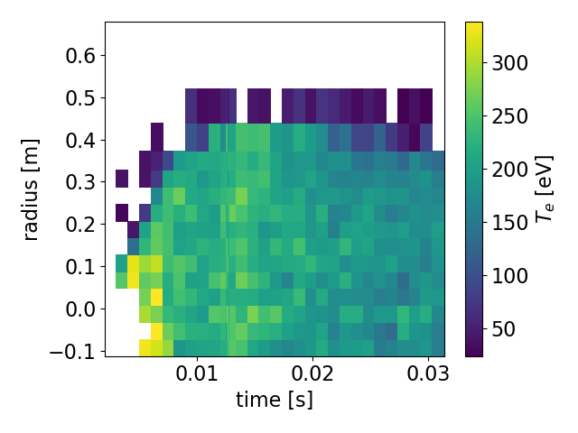
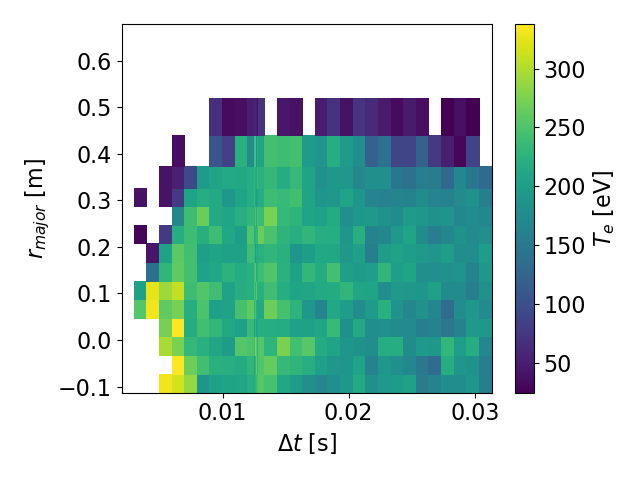
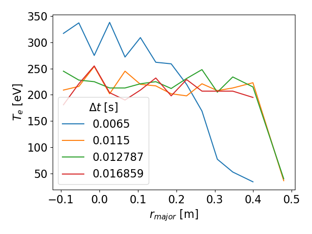

# MDSmonkey
MDSmonkey helps you explore an unfamiliar [MDSplus](https://github.com/MDSplus/mdsplus) database (`tree`) and begin 
analyzing the data in Python, in less than one minute. By using [xarray](http://xarray.pydata.org/en/stable/), 
publication-quality plots can be produced in 6 lines of code: 

```
    > from MDSmonkey import get_tree
    > tree = get_tree(101010,"phys","my.server.com")
    > te = tree.diagnostics.thomson.dts02.te
    > te = te.rename({"dim_0":"time","dim_1":"radius"})
    > te.attrs['long_name'] = r'$T_e$'
    > te.plot()
```




## Tutorial:

This walk-through illustrates a typical workflow when using MDSmonkey to approach an unfamiliar database, find what data is available, and plot it.

### Basic access & exploration
The first step is to initialize a tree. 

```
    > from MDSmonkey import get_tree
    > tree = get_tree(101010,"phys","my.server.com")
    > tree
    
    Branch \phys : number of subnodes: 14
    _____________________________________
    fueling     : Branch : number of subnodes: 4
    physics     : Branch : number of subnodes: 39
    vacuum      : Branch : number of subnodes: 15
    viz_only    : Branch : number of subnodes: 17
    electrodes  : Branch : number of subnodes: 6
    ...
```

Note that the ellipsis is just for the documentation, in reality all `Branches`
will be shown.

If you are using iPython, you can see the branches by typing `tree.<tab>`, which
will display a drop-down list of the branches. Use the up/down arrows and hit
enter to select. Typing `tree.p<tab>` will display a list a sublist, or in this
case will autocomplete to `tree.physics` because there is only one item starting
with `p`.

The tree is nested. Each node (`Branch` or `Leaf`) may have both `Leaf`s (which have
 `data` attributes) and `Branches` (which do not). Each node displays its path
name (ex: `\phys::top.physics`) when printed.  `Branch`es display their type,
path, and a short description of the of the subnodes below them. 
`Leaf`s display their type, path, and length (in bytes) of their data, along
with a short description of the subnodes below them (if any).

Note that by default, the `trim_dead_branches` feature of `get_tree` is used.  This
removes any `Branch` that does not have a `Leaf` with a non-zero amount of data as 
a descendant. Checking the length slows the initialization considerably (~20 seconds
vs ~1 second, depending on the size of the database).  If you are in a
hurry, you can supply the optional `trim_dead_branches=False` argument to `get_tree`.


```
    > tree.physics
    
    Branch \phys::top.physics : number of subnodes: 39
    __________________________________________________
    b0          : Leaf : number of subnodes: 4
    b0_avg      : Leaf : number of subnodes: 4
    be_max      : Leaf : number of subnodes: 4
    be_z0       : Leaf : number of subnodes: 4
    e_th        : Leaf : number of subnodes: 4
    ...    
    
```

Let's have a look at the data of the `Leaf` called `be_max`:

```
    > tree.physics.be_max
    
    Leaf \PHYS::B0 : length of data: 734 bytes
    __________________________________________
    data_err   : Leaf : number of subnodes: 0
    data_err_h : Leaf : number of subnodes: 0
    data_err_l : Leaf : number of subnodes: 0
    description: Leaf : number of subnodes: 0
    
```

Because `be_max` is a `Leaf` it has a `data` attribute. When introspecting this
attribute, the data is loaded at this time from the tree (there may be a pause).

```   
    > tree.physics.be_max.data

    <xarray.DataArray 'BE_MAX' (dim_0: 94999)>
    array([0.08225632, 0.08221801, 0.08222205, ..., 0.0775292 , 0.07756143,
           0.07744625], dtype=float32)
    Coordinates:
      * dim_0    (dim_0) float64 -0.0004996 -0.0004992 -0.0004988 ... 0.0375 0.0375
    Attributes:
        units:    T    
```           
     
The `xarray.DataArray` type knows how to plot itself nicely.
     
```  
    > tree.physics.be_max.data.plot() 
```
    
### Combining nodes into a single array or dataset
    
Sometimes diagnostic channels are broken up into different nodes instead of 
being represented as a single multi-dimensional array.


```
    > ndl = tree.diagnostics.thomson.dts02.ndl
    > ndl
    
    Branch \phys::top.diagnostics.thomson.dts02.ndl : number of subnodes: 14
    ________________________________________________________________________
    ndl_01: Leaf : number of subnodes: 4
    ndl_02: Leaf : number of subnodes: 4
    ndl_03: Leaf : number of subnodes: 4
    ndl_04: Leaf : number of subnodes: 4
    ndl_05: Leaf : number of subnodes: 4
    ...
```

We can handle this situation using the `concat` keyword to the `diagnosticXarray`
function.  The data of each 1D `Leaf` is stacked into a new 2D array indexed
by `channel`.

```
    > from MDSmonkey import diagnosticXarray
    > ndlarray = diagnosticXarray(ndl,behavior='concat')
    > ndlarray 
        
        <xarray.DataArray 'NDL_DTS02_01' (channel: 14, dim_0: 34)>
    array([[          nan, 1.6703393e+18, 1.3293034e+18, 1.5485215e+18,
            1.7731074e+18, 2.2600095e+18, 4.0675737e+18, 2.2424507e+18,   
    ...
            3.1138925e+18, 3.2072900e+18, 2.9299945e+18, 3.1664352e+18,
            3.0876216e+18, 3.2820408e+18]], dtype=float32)
    Coordinates:
      * dim_0    (dim_0) float32 0.0025 0.0035 0.0045 ... 
      * channel  (channel) <U6 'ndl_01' 'ndl_02' 'ndl_03' ... 
    Attributes:
        units:    1/m^2
```

In some cases, a diagnostic has heterogeneous data types. For instance, the
Thomson `ne`,`te` (electron temperature & density) belong in the same dataset 
because they share the same dimensions, but they are not part of the same array
because they are not the same kind of quantity & have separate units.  So, we
use `merge` behavior for this kind of information gathering.

```
    > ts = tree.diagnostics.thomson.dts02
    > ts
    
    Branch \phys::top.diagnostics.thomson.dts02 : number of subnodes: 6
    ___________________________________________________________________
    laser_energy: Leaf : number of subnodes: 4
    ne          : Leaf : number of subnodes: 4
    te          : Leaf : number of subnodes: 4
    te_max      : Leaf : number of subnodes: 4
    apd_monitors: Branch : number of subnodes: 2
    ndl         : Branch : number of subnodes: 14
    
    > tsarr = diagnosticXarray(ts,subset=['ne','te'],behavior='merge')
    > tsarr 
    
    <xarray.Dataset>
    Dimensions:   (dim_0: 34, dim_1: 16)
    Coordinates:
      * dim_0     (dim_0) float32 0.0025 0.0035 0.0045 ... 0.029859 0.030859
      * dim_1     (dim_1) float32 -0.0933 -0.0533 -0.0133 ... 0.4792 0.5592 
    Data variables:
        ne  (dim_1, dim_0) float32 nan nan nan 4.2912584e+18 ... 
        ne  (dim_1, dim_0) float32 nan nan nan 331.0 317.0 ... 
```

### Adding supplementary information 

Unfortunately MDSplus does not support dimension names so, they cannot be made 
available automatically -- the user needs to obtain this information by some
other means.  Once you know the dimension names, you can add them like this:

```
    > tsarr = tsarr.rename({"dim_0":"time","dim_1":"radius"})
    > tsarr
    
    <xarray.Dataset>
    Dimensions:   (radius: 16, time: 34)
    Coordinates:
      * time      (time) float32 0.0025 0.0035 0.0045 ... 0.028859 0.029859 
      * radius    (radius) float32 -0.0933 -0.0533 -0.0133 ... 0.4792 0.5592 
    Data variables:
        ne  (radius, time) float32 nan nan nan 4.2912584e+18 ... nan nan
        te  (radius, time) float32 nan nan nan 331.0 317.0 ... nan nan 
```

Another fancy feature is `long_name` attributes, which can be used to give
LaTeX-style mathematical expressions for titling the plots.

```
    >tsarr.time.attrs['long_name'] = r'$\Delta t$'
    >tsarr.radius.attrs['long_name'] = r'$r_{major}$'
    >tsarr.ne.attrs['long_name'] = r'$n_{e}$'
    >tsarr.te.attrs['long_name'] = r'$T_{e}$'
```

### Basic analysis and plotting

We can plot this data in several ways: as profiles at particular times or at
all times together, or as traces over time at particular radii (or all radii),
or we can make a 2D heatmap.

```
    >tsarr.te.plot()  #2D heatmap
    
    >tsarr.te.plot(x='radius') #Transpose the axes
    
    >tsarr.te.sel(time=16.6e-3,method='nearest').plot()  #profile at the time closest to 16.6 ms
    
    >tsarr.te.sel(time=slice(16.5e-3,20.5e-3)).plot() #2D heatmap over a shorter range
    
    >tsarr.te.sel(time=slice(5.5e-3,20.5e-3,5)).plot(hue='time') #series of 1D radial profiles colored by time
    
    >tsarr.te.isel(time=12).plot() #1D profile at the 12th time point
    
    >tsarr.te.mean(dim='time').plot() #Plot the time-averaged profile
```
 
Sample 2D heatmap.  Notice how the colorbar, x-axis, and y-axis automatically
have their names and units attached (if the units are available.) The fancy
`long_names` we gave are rendered nicely as well.



Sample 1D profile series. Note how the legend automatically shows the time
of each slice.



### Save and restore data

It is also possible to save & reload data to an HDF5 file:

```
    import xarray as xr
    > tsarr.to_netcdf("my_filename_for_ts.h5")
    > tsarr_reloaded = xr.load_dataset("my_filename_for_ts.h5")
```

# About the project

I (@lamorton) wrote this because I've worked with >4 different devices (MST, NSTX/NSTX-U, DIII-D, C-2W). 
Finding out what data is available and where has generally been a chore each time. The goal of MDSmonkey
was to have a tool that I could reuse for the N+1th device. It's intended for students or postdocs who need
to hit the ground running.

## Key features:

- **Exploration:** see all the branches in the tree that contain data items.
- **Tidiness:** by default, 'prunes' away branches that do not contain data, for an uncluttered view.
- **Speed:** data is loaded only when needed, and cached for reuse. 
- **Conciseness:** absolute minimum of boilerplate required to get nice plots.
- **Generality:** works for any MDSplus installation. No customization required.
- **Unification:** find, plot, and do math on the data with one tool.


## Key non-features:

- **Database editing:** does not write data or construct a tree. Meant for analysis. 
- **Liveness:** does not have live updates as data comes in from a shot. Meant for post-shot analysis.
- **Customization:** does not supply machine-specific defaults. Meant for robust generality.
- **Artificial intelligence:** does not infer anything (like dimension names). Meant to reflect exactly what exists in the database.
- **Graphical interface:** this tool use the iPython interpreter as the user interface.

## Possible eventual features:

- **Multishot interface:** presently, each shot needs a separate tree instance, because the 
             shape of the tree and the shape of the data records may change 
             shot-to-shot. It may be possible to circumvent these restrictions
             and enable a single tree to contain multi-shot data.
             

## Tools with overlapping scope:
- jScope/dwScope: GUIs with live updating plots of data (can't do math or explore the tree).
- traverser: GUI for looking at / editing the tree (can't plot the data, nor prune 'dead' branches).
- [Fusion Data Platform](https://github.com/Fusion-Data-Platform/fdp): very similar to MDSmonkey. Provides a standardized interface
                        to multiple machines, using JSON templates that must be written for each one.
- [OMFIT](https://omfit.io/): Has MDSplus support for some machines, with Scope, Profile, and EFIT GUIs

## Dependencies:

- django
- MDSplus
- xarray
